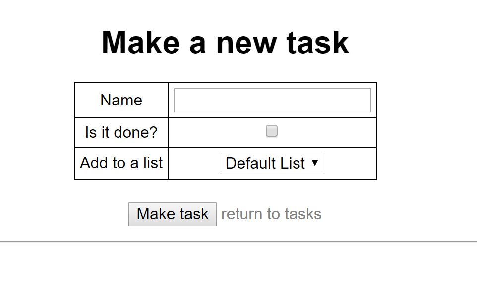

# Lab18-Consume a Web API

This project is a continuation of the previous lab 17 project where now we are creating a MVC Full CRUD Application to Consume the API that was created.

This application contains no database and communicates to the deployed Lab17 ToDoAPI and users can completely interact with the API without the need of any external applications
***
### Getting Started:
Visit the Application [here](http://eisj-lab18.azurewebsites.net/) to see a deployed version. If that is no longer available, follow these steps to deploy it locally but you will also need to check if the API is also still deployed.

* Download the latest .NET SDK
* Navigate and dowload the project files
* You will need to change the client base uri if the deployed API is no longer available and want to run this locally.
* After that is completed, run the application. If you see the bottom images then success! You can use this application to still interact with the deployed API if is is up or your own version of the API
***
### Visuals (taken from deployed site)
* Landing Page

* task landing

* add a list

* add a task

* update and delete list

* update and delete task

***